# Modular Real-Time Crypto Trading Framework

## System Overview

This document outlines the architecture and component flow for a single-user, modular crypto trading system using Coinbase. The system supports live strategy configuration, real-time OHLCV streaming, modular strategy execution, and automated trade placement.

## System Goals

- Monitor selected crypto markets in near real-time.
- Support dynamic user-defined strategies with real-time config updates.
- Process signals via a multi-step strategy engine.
- Execute limit/sell orders on Coinbase.
- Avoid duplicate trades using a central trade manager.
- Stream data via Kafka and store history in TimescaleDB.
- Allow backtesting on up to 5 years of data.

## Mermaid Architecture Diagram

```mermaid
flowchart TD
    subgraph UI["Frontend (User Config)"]
        A1["Strategy + Params\n(Symbols, Intervals, Lookback)"]
    end

    subgraph Redis["Redis (Config Store)"]
        A2["strategy_config:user_123"]
    end

    subgraph DataFetcher["Data Fetcher Service"]
        B1["Fetch Config"]
        B2["Subscribe to WebSocket (Polygon)"]
        B3["Stream OHLCV to Kafka/Redis"]
    end

    subgraph SymbolSelector["Symbol Selector"]
        C1["Ingest OHLCV Stream"]
        C2["Rank Top-N Symbols by Volume/Volatility"]
        C3["Publish Top-N to Kafka/Redis"]
    end

    subgraph SignalEngine["Signal Engine Service"]
        D1["Subscribe to OHLCV"]
        D2["Receive Top-N Symbol List"]
        D3["Check Trade Manager"]
        D4["Run Strategy Steps (1–4)"]
        D5["Emit Signal to Redis"]
    end

    subgraph TradeManager["Trade Manager"]
        E1["Track open trades"]
        E2["Prevent double-entry"]
    end

    subgraph TradingExecutor["Trading Executor"]
        F1["Subscribe to Signals"]
        F2["Send Order to Coinbase"]
        F3["Update Trade State"]
    end

    A1 --> A2
    A2 --> B1
    B1 --> B2 --> B3
    B3 --> C1 --> C2 --> C3
    C3 --> D2
    D2 --> D1 --> D3 --> D4 --> D5
    D3 --> E1
    D4 --> E2
    D5 --> F1 --> F2 --> F3 --> E1
```

## Component Responsibilities

### Frontend UI
- Updates strategy config (intervals, fast/slow periods, assets).
- Publishes config to Redis for live sync.

### Redis
- Stores latest user strategy configuration (`strategy_config:user_123`).
- Used as central state for caching & config sharing.

### Data Fetcher
- Subscribes to all available.
- Pulls OHLCV from Polygon via WebSocket.
- Streams candles to Kafka.

### Symbol Selector
- Ingests OHLCV data from WebSocket stream.
- Maintains real-time sliding window per symbol.
- Ranks Top-N symbols based on volume, volatility, or price movement.
- Publishes Top-N symbol list to Kafka for use by the signal engine.

### Signal Engine
- Listens to OHLCV streams.
- Checks active trades via Trade Manager.
- Runs 4-step signal strategy.
- Emits signals to Redis.

### Trade Manager
- Tracks all open trades.
- Prevents strategy from re-running on held positions.
- Maintains open trade registry (symbol, entry price, direction).

### Trading Executor
- Listens for signals from Redis/Kafka.
- Places real orders through Coinbase API.
- Updates Trade Manager upon fill/close.

### TimescaleDB
- Stores all raw OHLCV data for future backtesting.
